# CarND-Path-Planning-Project
Self-Driving Car Engineer Nanodegree Program
   
### Simulator.
You can download the Term3 Simulator which contains the Path Planning Project from the [releases tab (https://github.com/udacity/self-driving-car-sim/releases).

### Goals
In this project your goal is to safely navigate around a virtual highway with other traffic that is driving +-10 MPH of the 50 MPH speed limit. You will be provided the car's localization and sensor fusion data, there is also a sparse map list of waypoints around the highway. The car should try to go as close as possible to the 50 MPH speed limit, which means passing slower traffic when possible, note that other cars will try to change lanes too. The car should avoid hitting other cars at all cost as well as driving inside of the marked road lanes at all times, unless going from one lane to another. The car should be able to make one complete loop around the 6946m highway. Since the car is trying to go 50 MPH, it should take a little over 5 minutes to complete 1 loop. Also the car should not experience total acceleration over 10 m/s^2 and jerk that is greater than 50 m/s^3.

### Build instructions

From `build/` directory, `cmake ../src && make && ./path_planning`

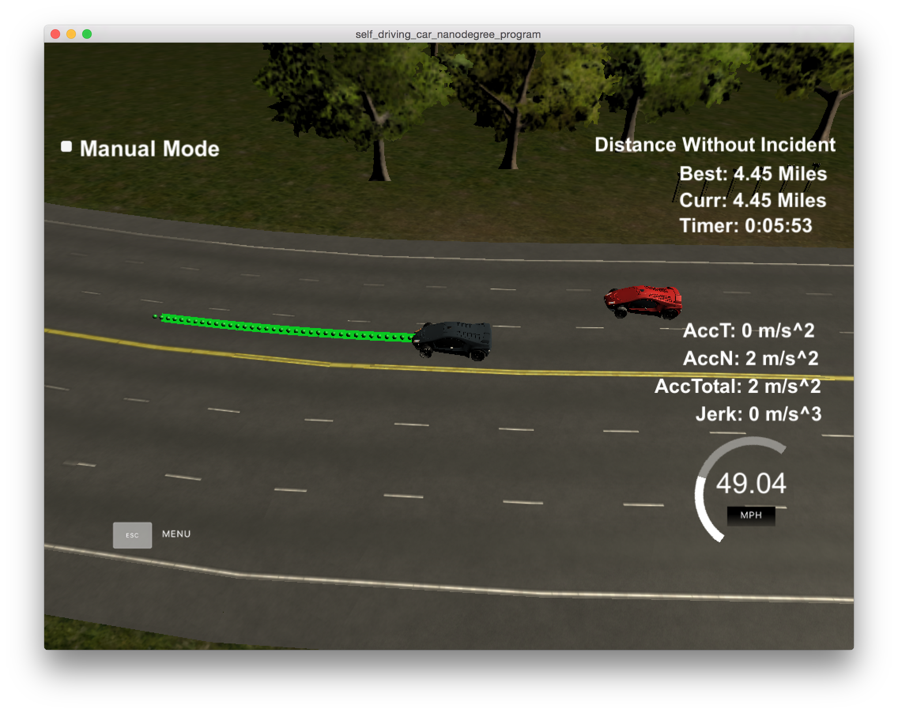

### Reflections

#### Problem space

#### Architecture

The most basic of functions this project performs is to send the car on a straight path along the highway. This is easier to do in Frenet space where `s` represents the longitudinal distance covered along the road and `d` represents the lateral distance from the waypoint line. This subsumes the curvature of the road, which would otherwise pose problems in cartesian space. We start by building a `Planner` which, given the waypoints, is capable to translating from Frenet to cartesian space.

##### Path Planner

Here's a view of the highway:

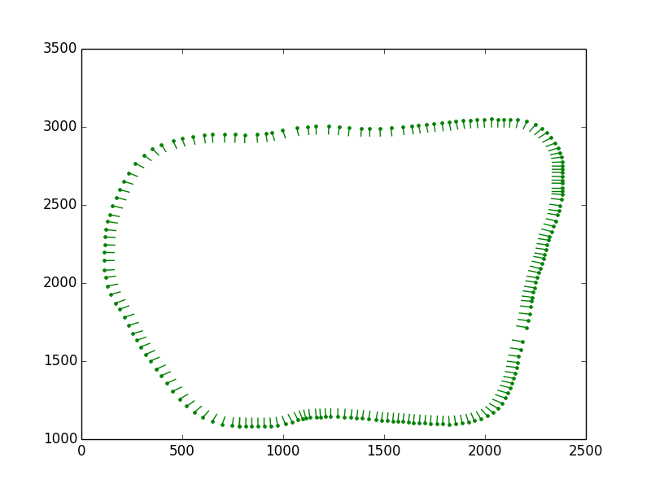

The waypoints provide a translation from `s` and `d` to cartesian `x` and `y`. They also indicate the curvature of the road at that point using `dx` and `dy`, the unit vectors that are components of the lateral `d` vector. These discrete waypoints are fed into spline functions `WP_spline_x`, `WP_spline_y`, `WP_spline_dx` and `WP_spline_dy`, which can now act as continuous functions capable of translating any `s` value to its corresponding vector values `x`, `y`, `dx`, `dy`. The translation to cartesian coordinates is very simple now: `(x + dx * d, y + dy * d)`

There remains one problem, though. `s` is actually a function that maps a given position in the road to the distance travelled. This function is strictly the same for straight roads. But with road curvature, this function differs for different lanes:

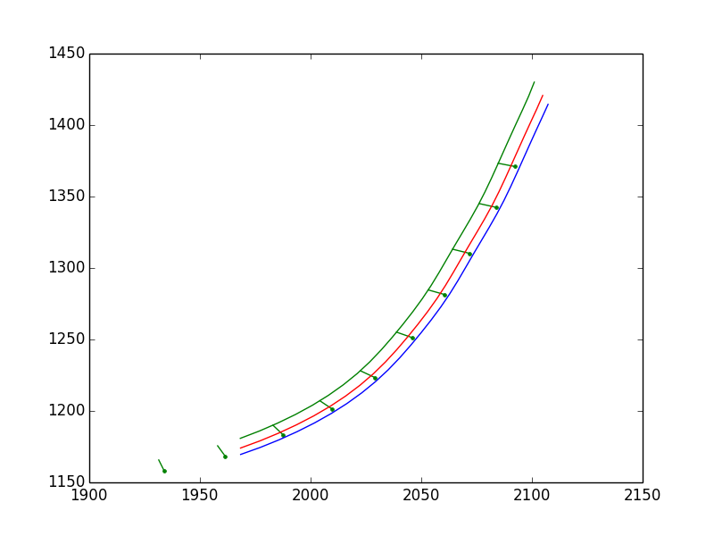

The above picture clearly illustrates how the outer lane has to "travel more" in order to be at the same position in the road as the inner lane. These errors tend to accumulate and cause speeding violations around curves. So, we maintain separate spline functions for each lanes - `lane_spline_s` and `lane_spline_rev_s` which translate lane-specific `s` values to waypoint-specific `s` values. The vehicle always tracks its `s` relative to the waypoint, but for generating trajectories, we have to use the `s` functions pertaining to the lanes in which the trajectories are being planned.

Lastly, we start with a buffer of `50` points in the first iteration and fill up the traversed points at every subsequent iteration. This takes care of the latency caused by the simulator requesting points and actually using them.

##### Trajectory Generator

Now that we have a mechanism to translate longitudinal motion to actual motion in cartesian space, we can venture out by incrementing `s` value at each timestep, while maintaining a steady `d` to move the car straight forward. Since the change in `s` represents velocity, we have constraints on the rate of change of `s`. We also have limits on the derivatives two levels down (acceleration and jerk). By taking small increments, we can certainly get beyond the limits, but the transition will not be smooth.

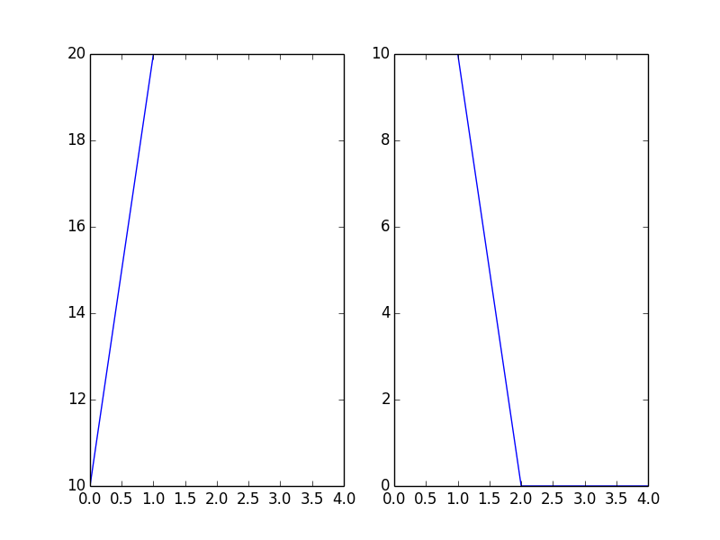

Instead, we use the Jerk minimization trajectory mechanism to increment the distance forward `s` such that the first and second order derivatives change continuously and the third order derivative (jerk) is minimized. Note that this mechanism does not place any bounds on the velocity or acceleration, but that can be controlled by choosing conservative boundary conditions. The initial boundary conditions are fetched from the vehicle state. The final boundary conditions for velocity are specified by the desired speed and final acceleration is specified to be zero. The time of transition and final distance are specified by the behaviour planner. It's easy to see that the changes start small, grow to the required level and gently decrease towards the end. Since there are no abrupt changes, there are no spikes in acceleration or jerk.

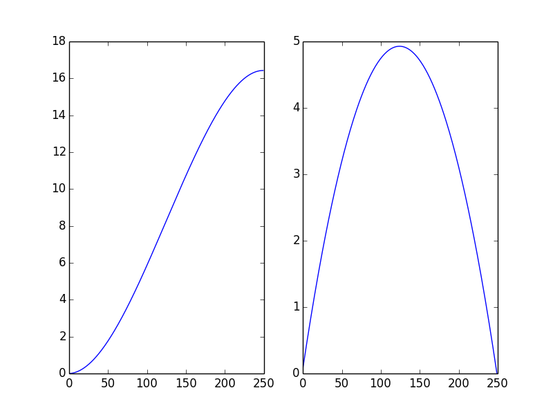

With JMT, a lane change entails a very similar trajectory. The only difference is with the boundary conditions. `di` is the `d` value of the starting lane and `df` is that of the desired lane. Providing a sufficient `tf` (3-4 seconds) ensures that the lateral velocity and acceleration are smooth and within limits.

##### Environment & Predictions

Before we can attribute different behaviours to the car, we need to consider the environment with moving obstacles. Each obstacle is reported with the state vector `[x, y, vx, vy, s, d]`. This makes it easy to characterize its speed (`sqrt(pow(vx,2)+pow(vy,2))`). But when I observed the speed values over many iterations, I found spikes and invalid transitions. 

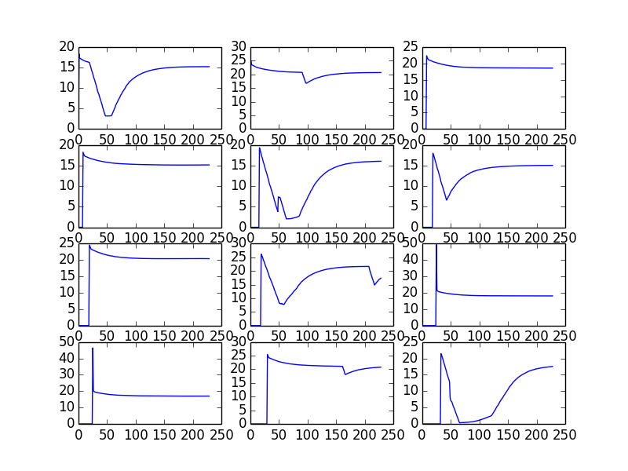

This error was traced down to an error in reporting of `d` values too. One can see extreme negative values for `d` which are inadmissible. Once the environment was configured to reject negative `d` values, we saw a more plausible distribution in `d`

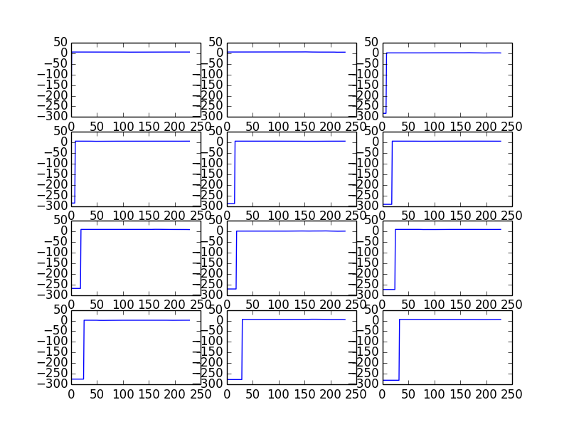

This change brought back `speed` and `s` values within reasonable ranges too. 

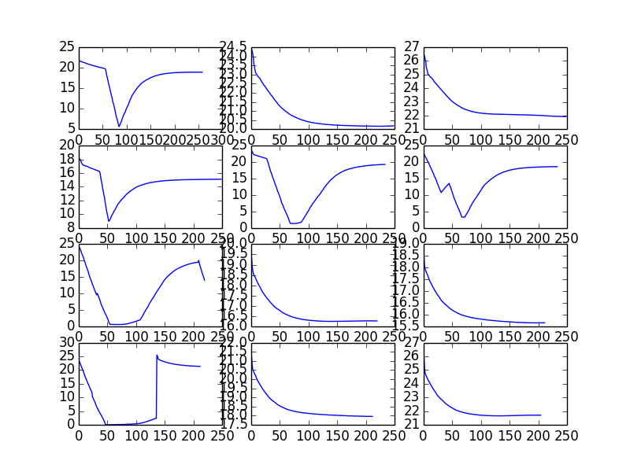 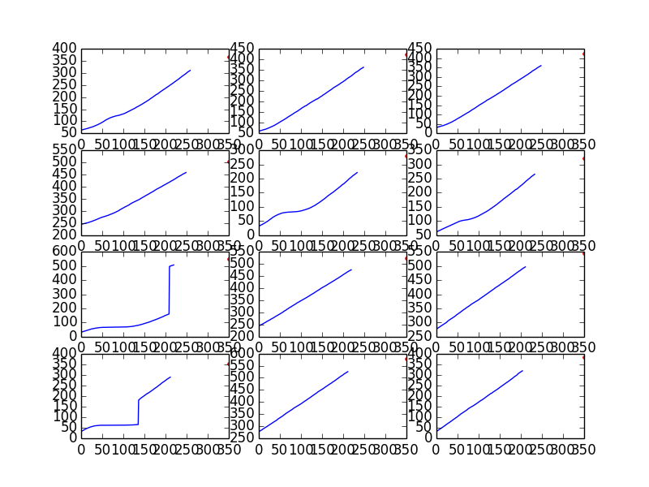

With valid state vectors for obstacles, we are able to predict the behaviour of these obstacles until a horizon. These predictions are generated for each timestep leading up to a horizon and used in the behaviour layer to compare obstacle positions to trajectory positions at a given timestep. The prediction has to also account for the latency caused by the buffering of trajectory points, upto `50` timesteps.

##### Behaviour Planner

Once the car is able to chart both straight and lane-change trajectories, we want to define definite behaviours like `KeepLane`, `ChangeLane`, `SlowDown` and form plans for when such behaviours are ideal. We start with a default `KeepLane` behaviour, which keeps the car moving ahead in the current lane at the maximum speed if possible. Else, the car tracks the vehicle in front and keeps its velocity. We use predicted positions of obstacles based on the timestep of the corresponding trajectory point.

Each behaviour decides the next set of candidate behaviours, depending on the current lane. For each candidate behaviour, we evaluate efficiency cost and safety cost. Efficiency cost is accrued when a vehicle is decelerating or running significantly lower than the `speed_limit`. Safety cost is decided based on how many collision points the trajectory entails, based on the predicted positions of the obstacles. Safety cost is weighted an order above efficiency. Here are some safe paths as adjudged by the behaviour planner:

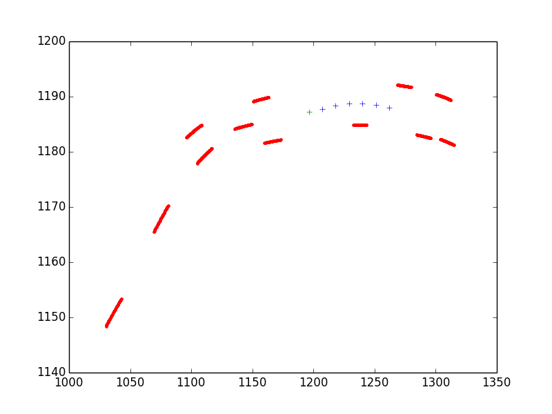 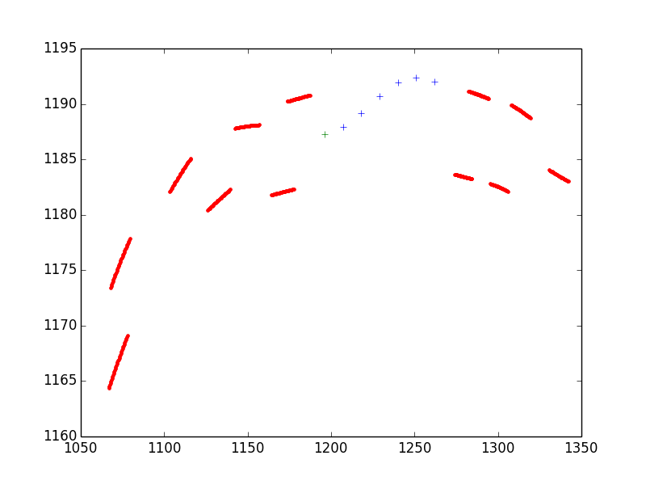 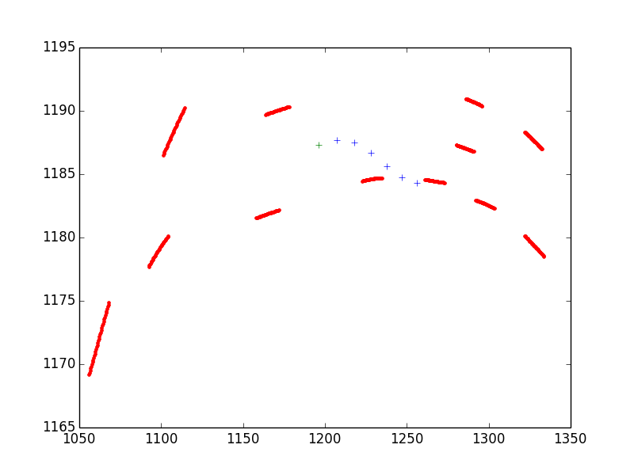 

Some behaviours are rejected because they may result in collisions:

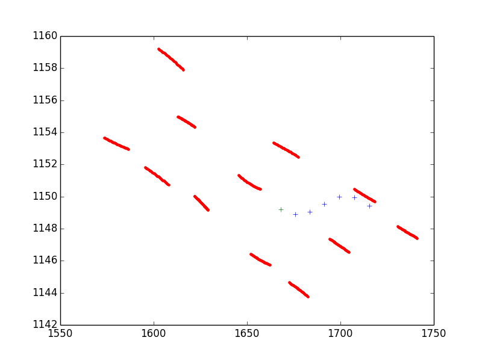 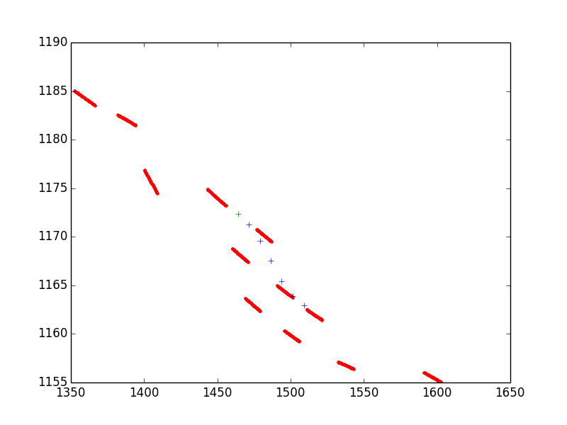 

##### Summary 

For the given track, this architecture seems to be sufficient. For more dynamic scenarios, it may be prudent to check the pipeline more frequently to detect possible collisions, cancel and possibly replan behaviours if necessary.

